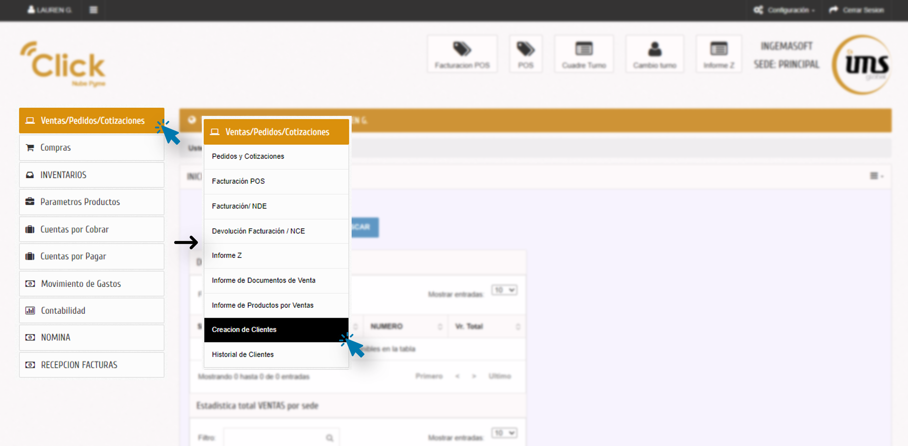
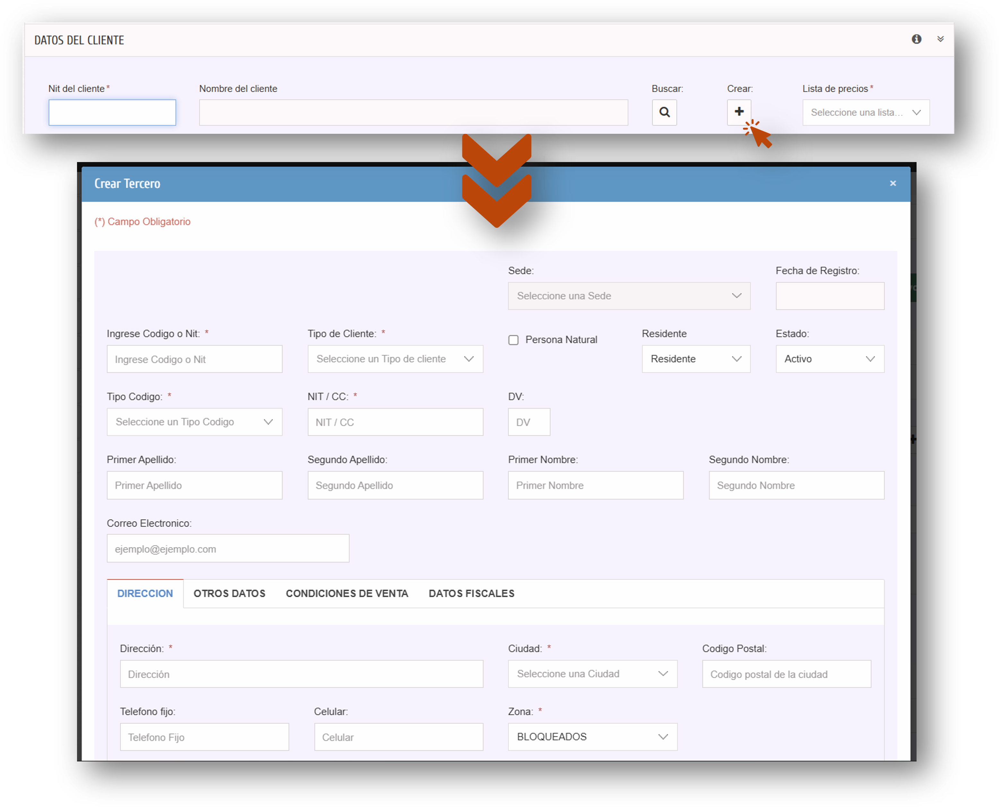
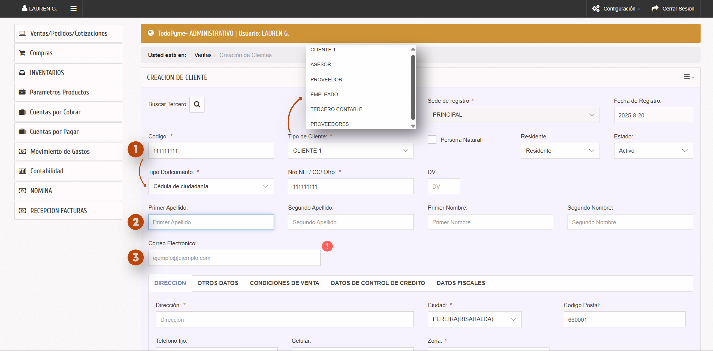
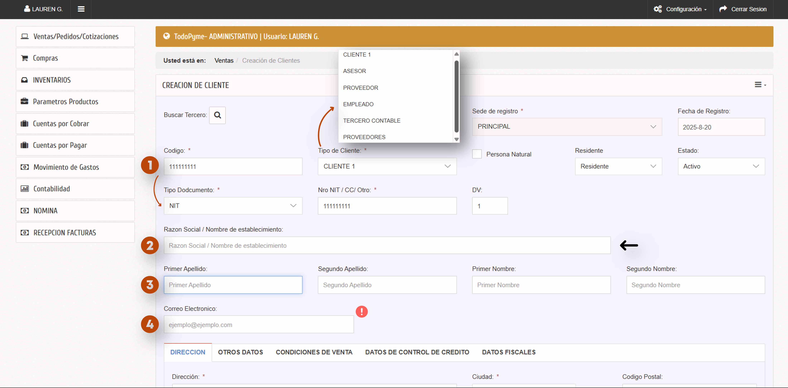
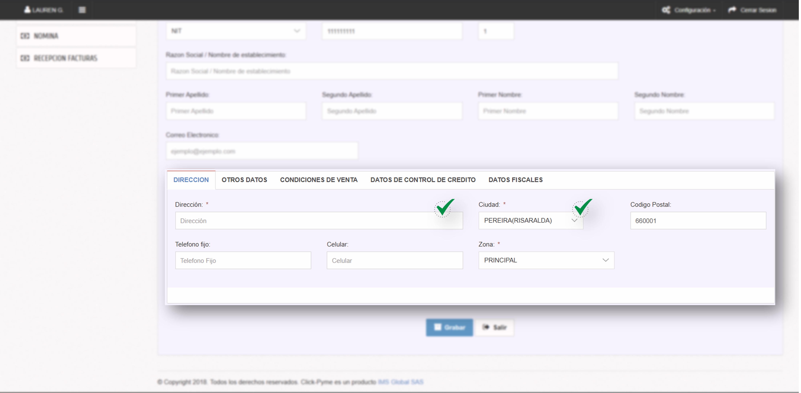
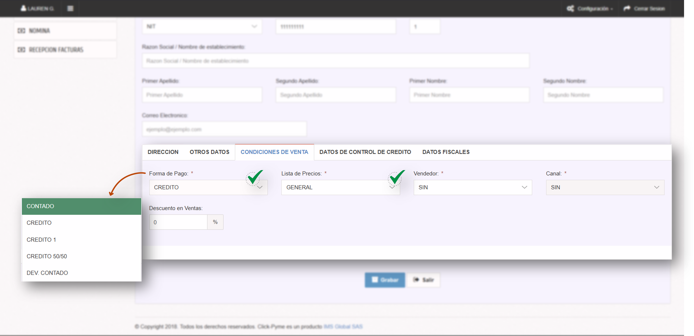
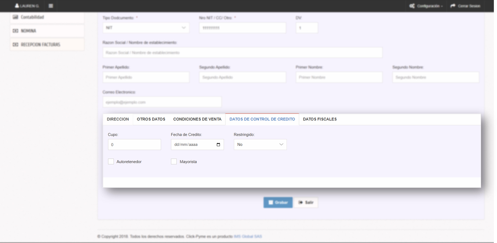
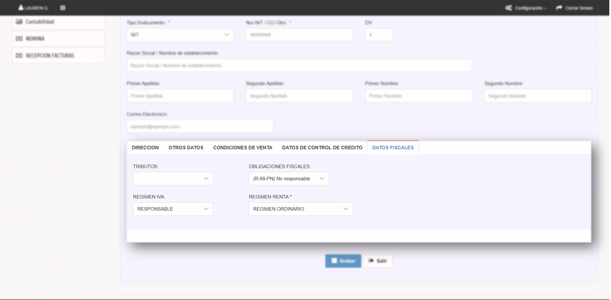
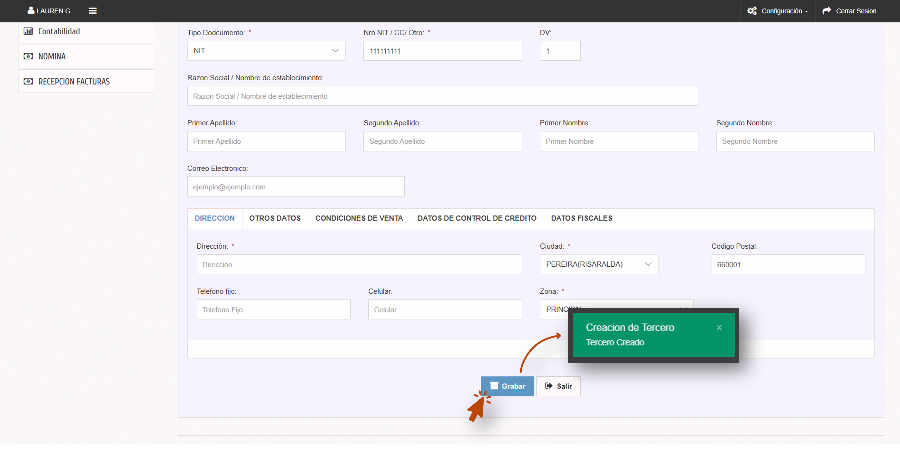
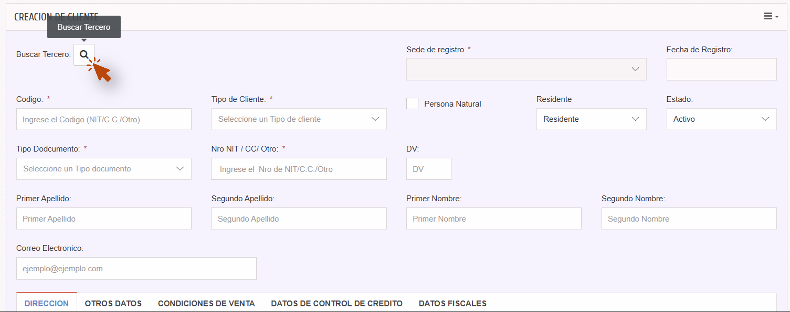

---
# ——— SEO / Social ———
title: "Cómo crear un cliente (tercero)"
description: "Registra un nuevo cliente o tercero para emitir facturas electrónicas sin errores DIAN."
image: assets/img/logos/logo.png

# ——— Metadatos internos ———
id_articulo: ventas_crear_cliente
producto: pyme
modulo: Ventas/Pedidos/Cotizaciones
submodulo: Creación de clientes
titulo: "Cómo crear un cliente (tercero)"
version: v1
palabras_clave: [cliente, tercero, nit, correo, condiciones de venta]
nivel_usuario: todos
fecha_creacion: 2025-08-20
ultimo_update: 2025-10-17
url_relativa: /ventas/terceros/crear
tags: [ventas, clientes, dian]
author: "IMS Docs"
---

  v1
  4–6 min

# Cómo crear un cliente (tercero)

!!! tip "Qué vas a lograr"
    Crear un **tercero** correcto (empresa o persona) listo para facturar **sin rechazos DIAN**.

!!! info "Prerrequisitos"
    - Identificación: **NIT + DV** (empresa) o **Cédula** (persona).  
    - **Correo** válido (para FE).  
    - Sugerido: **RUT** para configurar **Datos fiscales**.

> **Diferencia práctica:** Empresa ⇒ usa **Razón social** (con DV). Persona ⇒ **Nombres y apellidos** (sin DV).

## 1) Objetivo
Registrar correctamente un **tercero** (cliente/proveedor/contable) para evitar rechazos de **factura electrónica** y agilizar ventas.

!!! tip "¿Dónde se usa este tercero?"
    - 💡 **Facturación POS** → [Facturar en POS](./factura-pos.md)  
    - 📨 **Factura electrónica (NDE)** → [Emitir NDE](./factura-nde.md)  
    - ↩️ **Devolución / Nota crédito** → (Nota credito NCE - Proximamente)

> Si creas el tercero desde NDE o POS con **Crear tercero**, es el **mismo formulario** y se guarda en la **misma base**.

## 2) Requisitos previos
- Tener a mano **NIT/CC** (y **DV** si aplica) y **correo electrónico** válido.
- Si es empresa, validar con el **RUT**.

!!! warning "Campos críticos para DIAN"
    - **NIT/CC + DV (si aplica)**  
    - **Correo electrónico**  
    Errores en estos datos provocan *rechazo DIAN* al facturar.

---

## 3) Acceso y rutas alternativas

- Menú: **Ventas/Pedidos/Cotizaciones → Creación de clientes**  
  
- Alternativas: **Crear tercero** (abre el mismo formulario en ventana modal).  
  

---

## 4) Paso a paso

### A) Encabezado
1. **Código** *(obligatorio)*: alfanumérico, **sin espacios ni caracteres especiales**. Te permite identificar al cliente.  
2. **Tipo de cliente** *(obligatorio)*: se **autorrellena** (ej. *Cliente 1*). Cambia si no corresponde.  
3. **Tipo de documento** *(obligatorio)*: menú (NIT, Cédula, etc.).  
4. **Nro NIT/CC/Otro** *(obligatorio)*: numérico, **sin puntos ni comas**.  
5. **Con DV** *(opcional)*: visible solo con **NIT**; numérico.  
6. **Razón social / Nombre de establecimiento** *(opcional)*: solo si hay **DV** (empresas).  
7. **Nombres y apellidos**: requeridos si *no hay DV* (persona natural).  
8. **Correo electrónico** *(obligatorio)*: sin espacios.  

> **Regla práctica:** 

> - **Con DV (empresa)** → usa **Razón social**.
   

> - **Sin DV (persona)** → usa **Nombres y Apellidos**.
   

---

### B) Pestaña **Dirección** (facturación)
- **Dirección** *(obligatorio)*  
- **Ciudad** *(obligatorio)*: por defecto **Pereira** (ajústala).  
- **Teléfono fijo** *(opcional)*, **Celular** *(opcional)*.  

---

### C) Pestaña **Otros datos** (personalización)
- **Fecha de cumpleaños** *(opcional)*  
- **Contacto**, **Observaciones**, **Ocupación** *(opcionales)*  

---

### D) Pestaña **Condiciones de venta**
- **Forma de pago** *(obligatoria)*: por defecto **Contado**.  
- **Lista de precios** *(obligatoria)*: por defecto **Lista principal**.  
- **Vendedor** *(obligatorio)*: por defecto **SIN**.  

!!! info "Impacto en facturación"
    - Si la condición es **Crédito**, al facturar se crea automáticamente **“Por cancelar”** (no se puede borrar).  
    - Con **Contado**, se pueden registrar **medios de pago** (incluye pagos mixtos).

---

### E) Pestaña **Datos de control de crédito**
- **Cupo** *(opcional)*  
- **Fecha de crédito** *(opcional)*  
- **Restringido** *(opcional, por defecto No)*  
- **Autorretenedor** / **Mayorista** *(opcionales)*  

---

### F) **Datos fiscales**
- **Tributos** *(opcional)*  
- **Obligaciones fiscales** *(opcional, por defecto No responsable)*  
- **Régimen IVA** *(opcional, por defecto Responsable)*  
- **Régimen renta** *(opcional, por defecto Ordinario)*  

> Ajusta estos campos según el **RUT** del cliente para coherencia con DIAN.

---

### G) Grabar / Salir
- **Grabar**: guarda y **refresca** el formulario para un nuevo registro.  
- **Salir**: cierra el módulo **sin guardar**.  

---

## 5) Buscar y editar un tercero
- Clic en **Buscar** → localiza por código/NIT/nombre → **abrir** y editar.  
- Tras corregir **correo/NIT/DV**, vuelve a emitir documentos rechazados por DIAN.

---

## 6) Tabla técnica completa de campos

??? info "Ver tabla completa de campos (detalle técnico)"
    | Campo | Tipo | Obligatorio/Opcional | Autorelleno | Validación (si aplica) | Descripción |
    |---|---|---|---|---|---|
    | **Buscar** | Botón | — | — | — | Buscar/editar un tercero existente. |
    | **Código** | Alfanumérico | **Obligatorio** | — | Sin espacios ni caracteres especiales | Identificador único del tercero. |
    | **Tipo de cliente** | Dropdown | **Obligatorio** | Automático (p. ej. *Cliente 1*) | — | Depende del módulo origen. |
    | **Tipo de documento** | Dropdown | **Obligatorio** | — | — | NIT, Cédula, TI, CE, etc. |
    | **Nro NIT/CC/Otro** | Numérico | **Obligatorio** | Puede copiar **Código** | Sin puntos/comas/espacios | Identificación nacional/internacional. |
    | **Con DV** | Numérico | Opcional | — | Solo con **NIT**; sin puntos/comas | Dígito de verificación. |
    | **Razón social / Establecimiento** | Texto | Opcional | — | — | Visible/útil con **DV** (empresa). |
    | **Primer/Segundo Apellido** | Texto corto | Opcional\* | — | — | \*Obligatorios si **no hay DV** (persona). |
    | **Primer/Segundo Nombre** | Texto corto | Opcional\* | — | — | \*Obligatorios si **no hay DV** (persona). |
    | **Correo electrónico** | Texto | **Obligatorio** | — | Sin espacios; formato válido | Para envío de FE. |
    | **Dirección** | Texto | **Obligatorio** | — | — | Domicilio fiscal/comercial. |
    | **Ciudad** | Dropdown | **Obligatorio** | **Pereira** por defecto | — | Ciudad de residencia. |
    | **Teléfono fijo / Celular** | Numérico | Opcional | — | Sin comas/espacios | Contacto. |
    | **Fecha de cumpleaños / Contacto / Observaciones / Ocupación** | Varios | Opcional | — | — | Personalización del tercero. |
    | **Forma de pago** | Dropdown | **Obligatorio** | **Contado** por defecto | — | Impacta el flujo de pagos al facturar. |
    | **Lista de precios** | Dropdown | **Obligatorio** | **Lista principal** por defecto | — | Recalcula precios en ventas. |
    | **Vendedor** | Dropdown | **Obligatorio** | **SIN** por defecto | — | Vendedor asignado por defecto. |
    | **Cupo / Fecha de crédito / Restringido** | Varios | Opcional | — | — | Control de crédito. |
    | **Autorretenedor / Mayorista** | Check | Opcional | — | — | Condición fiscal/comercial. |
    | **Tributos / Obligaciones fiscales / Régimen IVA / Régimen renta** | Dropdown | Opcional | Por defecto (No responsable / Responsable / Ordinario) | — | Coherencia con RUT. |
    | **Grabar** | Acción | — | — | — | Guarda y refresca para nuevo registro. |
    | **Salir** | Acción | — | — | — | Cierra sin guardar. |

---

## 7) FAQs
- **¿Empresa o persona?**  
  - **Empresa**: NIT + **DV**, usa **Razón social**.  
  - **Persona**: Cédula **sin DV**, usa **Nombres y Apellidos**.

- **¿Puedo cambiar el tipo de cliente luego?**  
  Sí, pero revisa **condiciones de venta** y **datos fiscales** para mantener coherencia.

- **¿No me deja facturar?**  
  Revisa que **correo, NIT/DV y ciudad** estén completos. Los errores de DIAN suelen indicar qué campo falta.
  
---
!!! seealso "Guías relacionadas"

    

    -   :material-cash-register: **Facturar en POS** Básico

        Aprende a emitir facturas desde el punto de venta.  
        [:material-arrow-right: Ver guía](./factura-pos.md) 

    -   :material-receipt: **Factura electrónica (NDE)**  Nuevo

        Cómo emitir facturas electrónicas y enviarlas a DIAN.  
        [:material-arrow-right: Ver guía](./factura-nde.md)

    -   :material-file-restore: **Nota crédito electrónica (NCE)**  Avanzado

        Anula o corrige facturas con notas crédito.  
        [:material-arrow-right: Ver guía](./nce/contado-ref.md)

    

