# Cómo emitir una factura electrónica (NDE)

## 1) Objetivo
Generar y enviar una **factura electrónica** a la **DIAN** desde el módulo administrativo **NDE**.

## 2) Requisitos previos
- Prefijos/series **autorizados por DIAN** y vigentes.
- **Tercero** creado correctamente (NIT/DV y correo válidos).
- Permisos de usuario para **facturación**.

!!! warning "Advertencia crítica"
    Si el NIT/DV/correo del tercero es incorrecto, la DIAN **rechaza** el documento. Valida antes de emitir.

---

## 3) Paso a paso

### A. Acceder a NDE
Menú: **Ventas/Pedidos/Cotizaciones → Facturación/NDE**  
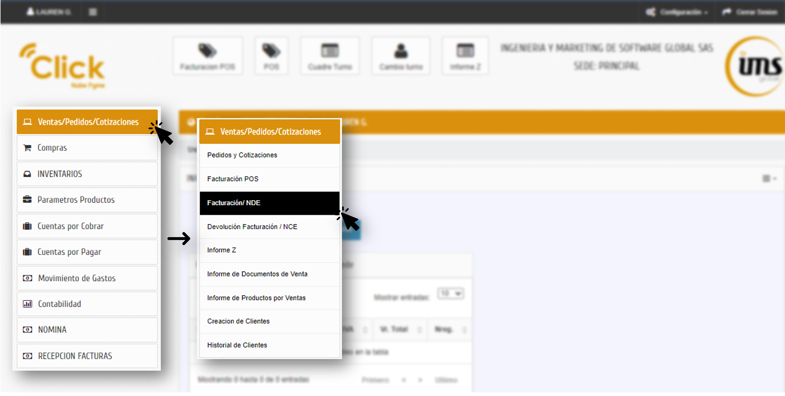

### B. Encabezado del documento
1. **Documento (prefijo/serie)**: selecciona desde la parametrización.  
2. **Número**: se **autonumera** (edición manual sujeta a rol).  
3. **Fecha de factura**: se autocompleta (no puede ser futura).  
4. Clic en **Aceptar** para crear el borrador.  
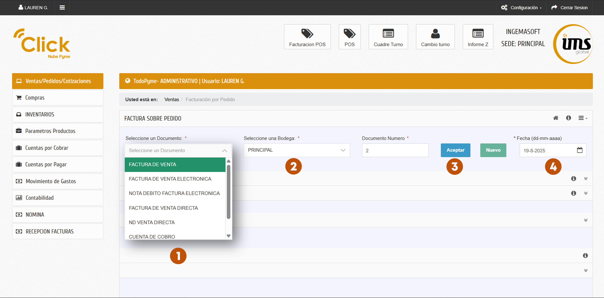

### C. Datos del cliente
- **Cliente**: búscalo por NIT/Nombre o usa **Crear tercero**.  
- (Si aplica) **Vendedor**, **Lista de precios** y **Condiciones de pago** (se autocompletan; ajusta si corresponde).  
- Clic en **Continuar**.  
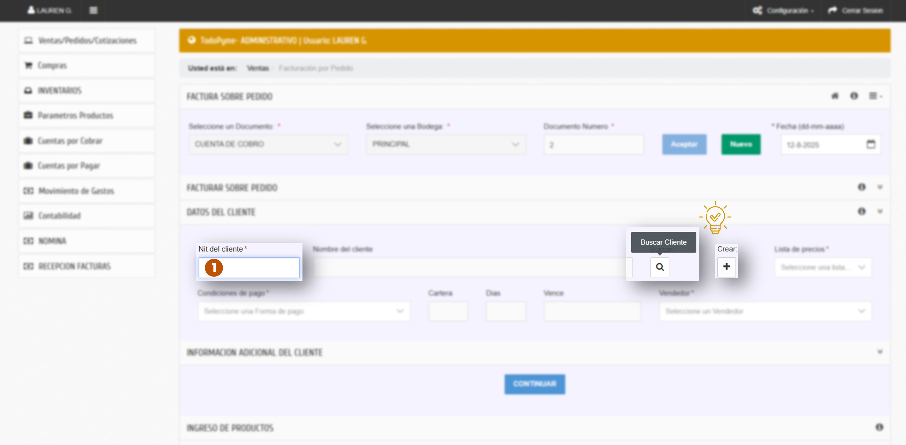
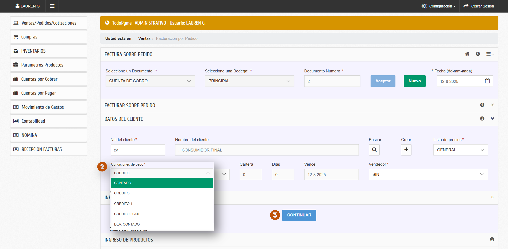

!!! info "Condición de pago: cómo afecta a los **pagos**"
    - **Crédito** → al crear el documento se registra automáticamente un pago **“Por cancelar”** por el total.  
      - Ese registro **no se puede borrar** mientras la condición siga en **Crédito**.
    - **Contado** → podrás cargar **cualquier medio de pago** (efectivo, tarjeta, transferencia, etc.), incluso **pagos mixtos**, en el Paso 3 (*Medios de pago*).
    - ¿Te equivocaste? Cambia la condición a **Contado**, guarda/actualiza y vuelve al Paso 3 para **eliminar “Por cancelar”** y registrar los pagos reales.

!!! abstract "FACTURA EN 3 PASOS"
    Sigue estos 3 pasos para completar la factura exitosamente.
    
    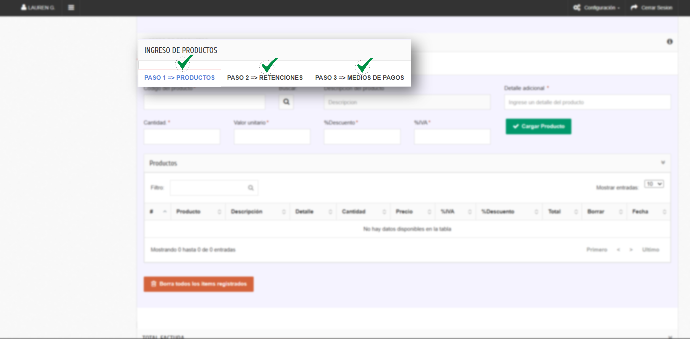

### D. Paso 1 → Productos
1. En **Código del producto**, selecciona el ítem.
2. Ingresa **Cantidad**, **Valor unitario** y **Impuesto (IVA/INC/ICA)**.  
   > Nota: la **aceptación de decimales** en cantidad depende de la parametrización.
3. (Opcional) **Detalle adicional** y **Descuento** (% o valor) según políticas.
4. Clic en **Cargar Producto** para agregar la línea.  
5. **Borrar ítems** elimina todas las líneas cargadas.  
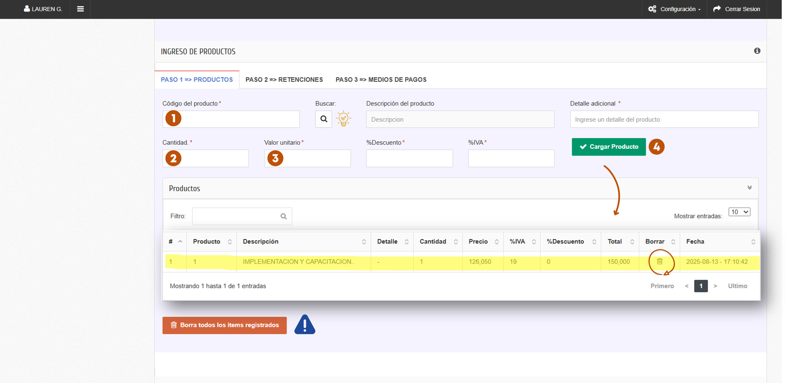

### E. Paso 2 → Retenciones (si aplica)
- Revisa la **Tabla de retenciones** y **aplica** la que corresponda (según parametrización fiscal).  
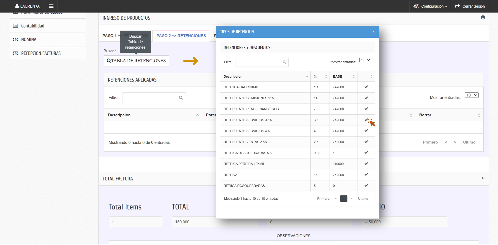

!!! info "Reglas de negocio según **Condición de pago**"
    - **Crédito**: el sistema crea automáticamente un registro de pago **“Por cancelar”** por el total.  
      - Este registro **no se puede borrar** mientras la condición siga en **Crédito**.  
      - Si necesitas registrar pagos (efectivo, tarjeta, etc.), **cambia primero** la condición a **Contado**.
      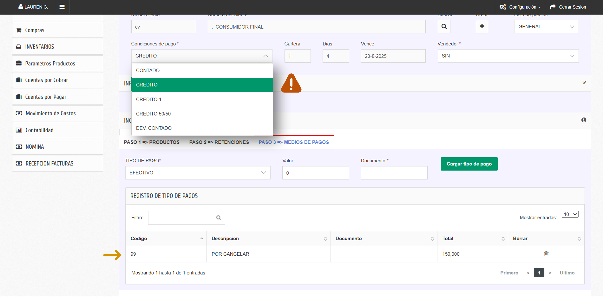
    - **Contado**: puedes cargar **cualquier tipo de pago** (efectivo, tarjeta, transferencia, etc.), uno o varios (pagos mixtos), hasta cubrir el total.
    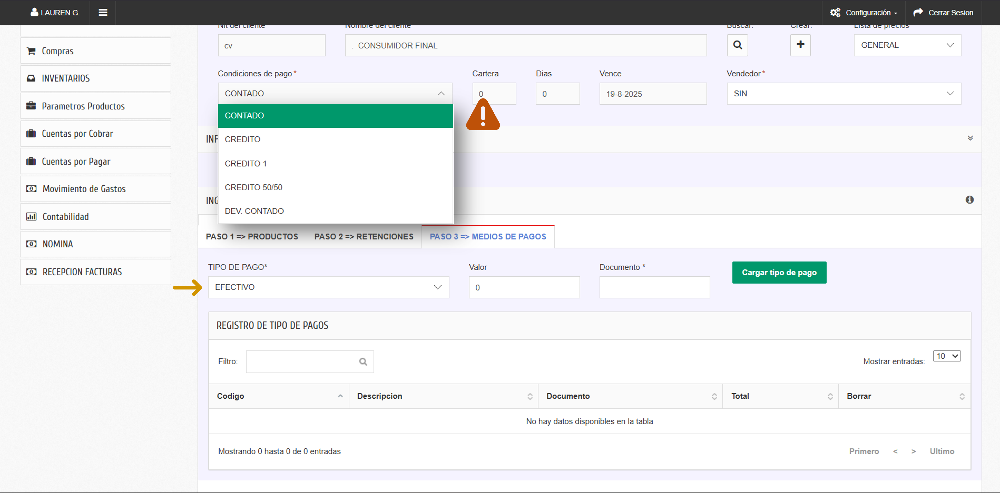

### F. Paso 3 → Medios de pago y verificacion
1. Selecciona **Tipo de pago** (catálogo activo) e ingresa **Valor**.
2. Clic en **Cargar tipo de pago**; repite para pagos mixtos hasta cubrir el total.  
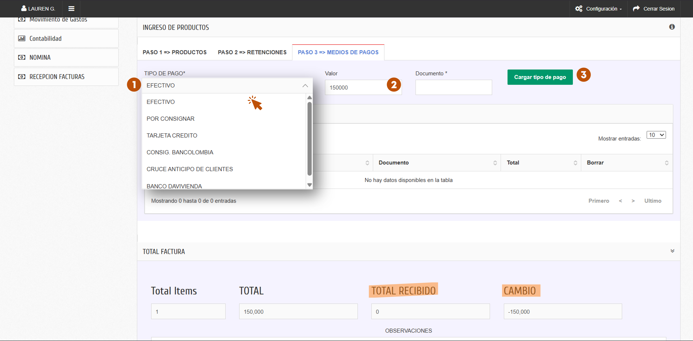
3. Verifica que el **TOTAL RECIBIDO** coincida con el pago ingresado y si hay algun **CAMBIO**
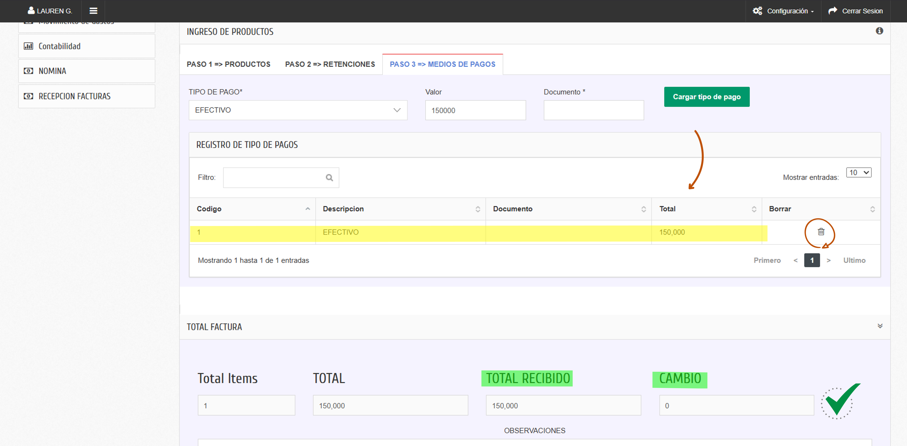

### G. Finalizar
- **Grabar**: guarda el documento **sin** enviarlo a DIAN.  
- **Borrar**: limpia el documento para empezar de cero.  
- **Anular**: anula el documento (total).  
- **Cerrar**: **envía a DIAN** (muestra respuesta y maneja reintentos/errores).  
- **Salir**: cierra el módulo.  
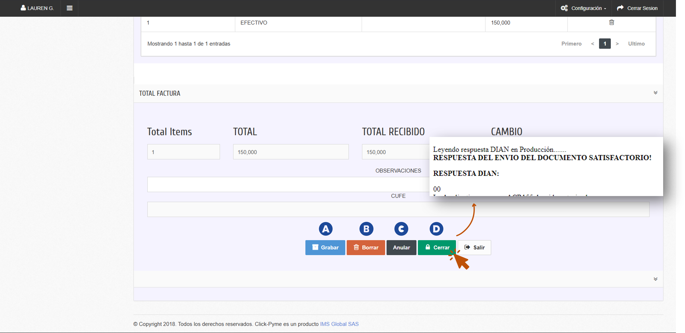

---

## 4) Campos y validaciones (NDE)

| Campo en pantalla               | Oblig./Opc. | Tipo            | Validación / Reglas (si aplica)                                           | Notas de negocio |
|--------------------------------|-------------|-----------------|----------------------------------------------------------------------------|------------------|
| **Documento (prefijo/serie)**  | Obligatorio | Dropdown/Texto  | Debe existir en parametrización; sin espacios extras                       | El nombre varía según empresa |
| **Número**                     | Obligatorio | Auto/Texto      | Autonumera; restricción de edición según rol                               | Consecutivo de la factura |
| **Fecha de factura**           | Obligatorio | Fecha           | Autocompletado; **no** puede ser futura                                    |                  |
| **Aceptar**                    | —           | Acción          | Crea nueva factura (borrador)                                              |                  |
| **Cliente**                    | Obligatorio | Texto/Búsqueda  | Debe existir o crearse; **NIT/DV válidos**                                  |                  |
| **Vendedor (si aplica)**       | Obligatorio | Dropdown        | Autocompletado; opciones activas                                           | Cambiar si es necesario |
| **Lista de precios**           | Obligatorio | Dropdown        | Autocompletado; debe existir; **recalcula** precios                         | Cambiar si es necesario |
| **Condiciones de pago**        | Obligatorio | Dropdown/Texto  | Catálogo activo; **define el comportamiento de pagos**: Crédito ⇒ crea “Por cancelar” (bloqueado). Contado ⇒ permite cargar medios de pago.                                                            |                  |
| **Continuar**                  | —           | Acción          | Confirma cliente                                                            |                  |
| **Paso 1 – Productos**         | —           | Acción          | Abre sección de registro de productos                                      |                  |
| **Ítem: Código del producto**  | Obligatorio | Texto/Búsqueda  | Debe existir en productos                                                  |                  |
| **Detalle adicional**          | Opcional    | Texto           | Máx. caracteres                                                            |                  |
| **Ítem: Cantidad**             | Obligatorio | Numérico        | `> 0`; **decimales según parametrización**                                 |                  |
| **Ítem: Valor unitario**       | Obligatorio | Numérico        | `≥ 0`; depende de lista                                                    |                  |
| **Ítem: Impuesto (IVA/INC/ICA)**| Obligatorio| Dropdown        | Según producto; tasas válidas DIAN                                         |                  |
| **Descuento (si aplica)**      | Opcional    | Numérico/%      | Límite por rol/regla                                                       |                  |
| **Cargar Producto**            | —           | Acción          | Valida y agrega la línea                                                   |                  |
| **Borrar ítems**               | —           | Acción          | Elimina todas las líneas registradas                                       |                  |
| **Paso 2 – Retenciones**       | —           | Acción          | Abre sección de retenciones                                                |                  |
| **Tabla de retenciones**       | Opcional    | Búsqueda        | Aplica retención si corresponde                                            |                  |
| **Paso 3 – Medios de pago**    | —           | Acción          | Abre sección de pagos                                                      |                  |
| **Tipo de pago**               | Obligatorio | Dropdown/Texto  | Catálogo activo; **sólo editable si la condición es Contado**.                                                            |                  |
| **Valor (pago)**               | Obligatorio | Numérico        | `> 0`; suma total debe **cuadrar**                                         |                  |
| **Cargar tipo de pago**        | —           | Acción          | Confirmación del pago                                                      |                  |
| **Grabar**                     | —           | Acción          | Guarda **sin** enviar a DIAN                                               |                  |
| **Borrar**                     | —           | Acción          | Limpia el documento para sobreescribir                                     |                  |
| **Anular**                     | —           | Acción          | Anulación total del documento                                              |                  |
| **Cerrar**                     | —           | Acción          | **Envía a DIAN**; maneja reintentos/errores                                |                  |
| **Salir**                      | —           | Acción          | Salir del módulo                                                           |                  |

---

## 5) Errores DIAN comunes (causa → solución)

- **“Error en tercero / adquirente”**  
  *Causa:* NIT/DV/Correo inválidos o tipo de documento incorrecto.  
  *Solución:* Corrige la ficha del **tercero** y vuelve a emitir.

- **“Fecha fuera de rango / inválida”**  
  *Causa:* fecha futura o fuera del rango permitido.  
  *Solución:* Ajusta la **Fecha de factura** dentro del rango DIAN.

- **“Tasa/Responsabilidad de impuestos inválida”**  
  *Causa:* impuesto del ítem no coincide con parametrización DIAN.  
  *Solución:* Corrige impuesto en **producto** / parametrización.

- **“Prefijo o numeración no autorizada”**  
  *Causa:* serie/prefijo sin autorización o fuera de rango.  
  *Solución:* Verifica la **numeración** vigente y reintenta.

- **“Documento duplicado / CUFE existente”**  
  *Causa:* reenvío con numeración ya aceptada.  
  *Solución:* No reemitir; si falló, genera con numeración válida.

---

## 6) Preguntas frecuentes

- **¿Puedo hacer pagos mixtos en NDE?**  
  Sí: registra varios **Tipos de pago** hasta cubrir el total.

- **¿Cómo edito un ítem ya cargado?**  
  Elimina la línea y vuelve a cargarla con los valores correctos.

- **¿Cuál es la diferencia entre Grabar y Cerrar?**  
  **Grabar**: guarda sin DIAN. **Cerrar**: envía a DIAN y muestra la respuesta.

- **El sistema me creó “Por cancelar” y no me deja borrarlo. ¿Qué hago?**  
  Eso ocurre cuando la **Condición de pago = Crédito**. Cambia la condición a **Contado**, guarda/actualiza, luego carga los pagos que correspondan (efectivo, tarjeta, transferencia…).  
  Si la venta **sí es a crédito**, deja “Por cancelar” tal cual y no cargues otros pagos aquí.