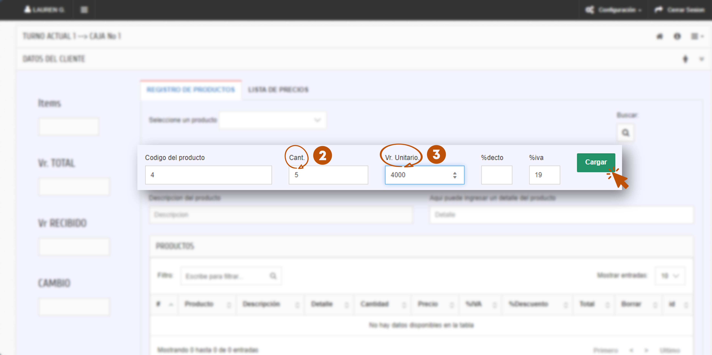

# Cómo facturar en POS (Mostrador)

## 1. Objetivo
Emitir una venta **rápida** desde el **POS**, registrar pagos (incluye **pagos mixtos**) y, si aplica, **generar factura electrónica** para la DIAN.

!!! info "Prerequisito"
    El **cliente** debe existir y tener **NIT/DV** (si aplica) y **correo** válidos.  
    👉 [Crear cliente / tercero](./crear-clientes.md)

## 2. Requisitos previos
- Rol con permisos de **POS / Caja**.
- (Si aplica) **Caja abierta** y dispositivos configurados.

!!! warning "Advertencia"
    Si vas a emitir **factura electrónica** desde POS, valida que el **tercero** tenga **NIT/DV** y **correo** correctos. De lo contrario, la **DIAN** rechazará el documento (“Error en tercero”).

---

## 3. Paso a paso

1) **Acceder a POS**  
   Menú: **Ventas/Pedidos/Cotizaciones → Facturación POS**.  

   

2) **Seleccionar producto (o buscar por categoría)**  
   Usa el campo “Seleccione un producto” o el buscador de la derecha. 

   

3) **Ingresar cantidad y valor → Cargar**  
   > Nota: **Cantidad no acepta decimales** en POS.  
   Define **Cant.**, **Vr. Unitario** e impuestos si aplica. Pulsa **Cargar**.  

   

4) **Verificar ítems cargados**  
   Revisa la tabla de productos, el **Vr. TOTAL** y elimina líneas si es necesario.  

   

5) **Registrar pagos (incluye pagos mixtos)**  
   - En **Tipo de pago**, elige del catálogo (efectivo, tarjeta, etc.).  
   - Indica **Valor** y pulsa **Cargar pago**.  
   - Repite para pagos mixtos hasta cubrir el total.  

   

6) **Confirmar que el total recibido cubre el total**  
   El **Vr RECIBIDO** debe igualar el **Vr. TOTAL**; **CAMBIO** debe ser 0.  

   

7) **Cerrar y emitir**  
    
   - **Factura electrónica**: envía la **factura electrónica a la DIAN**.  
   > El botón **Factura electrónica** siempre está visible, pero **no permite envío** si faltan campos obligatorios: el sistema mostrará un mensaje de completar datos.

    > **Respuesta de la DIAN:** Una vez enviada la factura la dian emite una respuesta con el mensaje: **ENVIO DEL DOCUMENTO SATISFACTORIO**  

   

---

## 4. Campos y validaciones

| Campo en pantalla                 | Oblig./Opc. | Tipo             | Validación / Reglas (si aplica)                                | Notas de negocio |
|----------------------------------|-------------|------------------|-----------------------------------------------------------------|------------------|
| **Cliente**                      | Obligatorio | Texto/Búsqueda   | Debe existir o crearse; **NIT/DV válidos**                      |                  |
| **Fecha de factura**             | Obligatorio | Fecha            | **Autocompletado**                                              |                  |
| **Vendedor (si aplica)**         | Obligatorio | Dropdown         | Autocompletado; **opciones activas**                           | Cambiar si es necesario |
| **Lista de precios**             | Obligatorio | Dropdown         | Autocompletado; **debe existir**; **recalcula precios**        | Cambiar si es necesario |
| **Condiciones de pago**          | Obligatorio | Dropdown/Texto   | **Catálogo activo**                                             |                  |
| **Ítems: Seleccione un producto**| Obligatorio | Texto/Búsqueda   | Debe existir en **productos**                                   |                  |
| **Ítems: Cantidad**              | Obligatorio | Numérico         | **> 0; no acepta decimales**                                    |                  |
| **Ítems: Valor unitario**        | Obligatorio | Numérico         | `≥ 0`; depende de **lista de precios**                          |                  |
| **Ítems: Impuesto (IVA/INC/ICA)**| Obligatorio | Dropdown         | Según producto; **tasas válidas DIAN**                          |                  |
| **Descuento (si aplica)**        | Opcional    | Numérico/%       | Límite por **rol/regla**                                        |                  |
| **Detalle adicional**            | Opcional    | Texto            | Máx. caracteres                                                 |                  |
| **Botón Cargar (ítem)**          | —           | Acción           | Aplica **validaciones previas**                                 |                  |
| **Tipo de pago**                 | Obligatorio | Dropdown/Texto   | **Catálogo activo**                                             |                  |
| **Valor (pago)**                 | Obligatorio | Numérico         | `> 0`; suma total debe **cuadrar**                              |                  |
| **Botón Cargar pago**            | —           | Acción           | **Confirmación del pago**                                       |                  |
| **Botón Cerrar D.E. POS**        | —           | Acción           | **Graba y cierra** la venta POS                                 |                  |
| **Botón Factura electrónica**    | —           | Acción           | **Envío a DIAN**; bloquea si faltan obligatorios                |                  |
| **Botón Cancelar**               | —           | Acción           | **Salir** del módulo                                            |                  |

---

## 5. Solución rápida a errores frecuentes

- **Pago insuficiente / Totales no cuadran**  
  **Causa:** el total de **pagos** no cubre el **total**.  
  **Solución:** agrega otro pago (mixto) o ajusta valores hasta cuadrar.

- **Producto sin impuesto / tasa inválida**  
  **Causa:** impuesto del producto mal parametrizado.  
  **Solución:** corrige el impuesto en **Parámetros de productos** y vuelve a cargar el ítem.

- **Lista de precios incorrecta**  
  **Causa:** la lista asignada no incluye el producto o precio en 0.  
  **Solución:** cambia de **lista** o corrige el precio y vuelve a cargar.

- **Error en tercero (al emitir electrónica)**  
  **Causa:** NIT/DV/Correo inválidos.  
  **Solución:** corrige la **ficha del tercero** y vuelve a emitir.

---

## 6. Preguntas frecuentes (FAQs)

- **¿Cómo hago pagos mixtos (efectivo + tarjeta)?**  
  Registra un pago por cada medio (**Tipo de pago + Valor → Cargar pago**) hasta cubrir el total.

- **¿Puedo cambiar la lista de precios desde POS?**  
  Sí, si tu rol lo permite. Cambiarla **recalcula** los precios de los ítems que cargues después.

- **¿Puedo modificar precio o cantidad del ítem?**  
  Depende de permisos. Si ya cargaste la línea, bórrala y vuelve a agregar con los valores correctos.

- **¿POS siempre muestra “Factura electrónica”?**  
  Sí. Si faltan obligatorios, el sistema **bloquea el envío** y te pide completarlos.

---

## Relacionados
- 📨 ¿Necesitas factura electrónica administrativa? → [Emitir NDE](./factura-nde.md)
- 🧾 ¿El cliente no existe aún? → [Crear cliente](./crear-clientes.md)
- ↩️ ¿Devolver una venta? → [NCE](./nota-credito-nce.md)