

  v1
  6–8 min

!!! tip "Qué vas a lograr"
    Emitir una **Nota Crédito Electrónica** para una **factura de contado**, **referenciando** la factura original y enviarla a la **DIAN**.

!!! info "Prerrequisitos"
    - Factura base **aceptada** en DIAN (número y/o **CUFE**).  
    - **Cliente** correcto (**NIT/DV** y **correo**) 👉 [Crear/editar cliente](../crear-clientes.md).  
    - **Serie/Documento** y **Bodega** parametrizados.

!!! warning "Reglas DIAN clave"
    - La NCE **debe referenciar** la factura (número y/o CUFE).  
    - **Motivo** obligatorio (catálogo DIAN).  
    - En NCE **parcial**, no exceder cantidades/valores/impuestos de la factura base.

---

## Paso a paso

### 1) Acceder al módulo NCE
Menú: **Ventas/Pedidos/Cotizaciones → Devolución Facturación / NCE**  
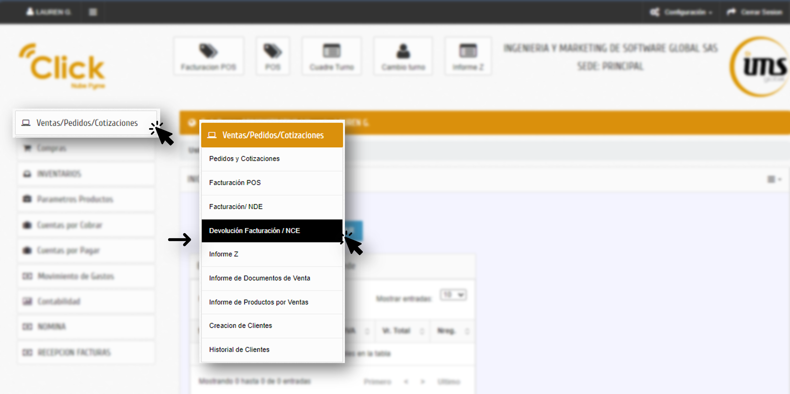

### 2) Encabezado del documento
Selecciona **Documento (prefijo/serie)** y **Bodega**. Verás **Número** (autonumera) y **Fecha** (auto). 
Haz clic en **Aceptar** para crear el borrador. 
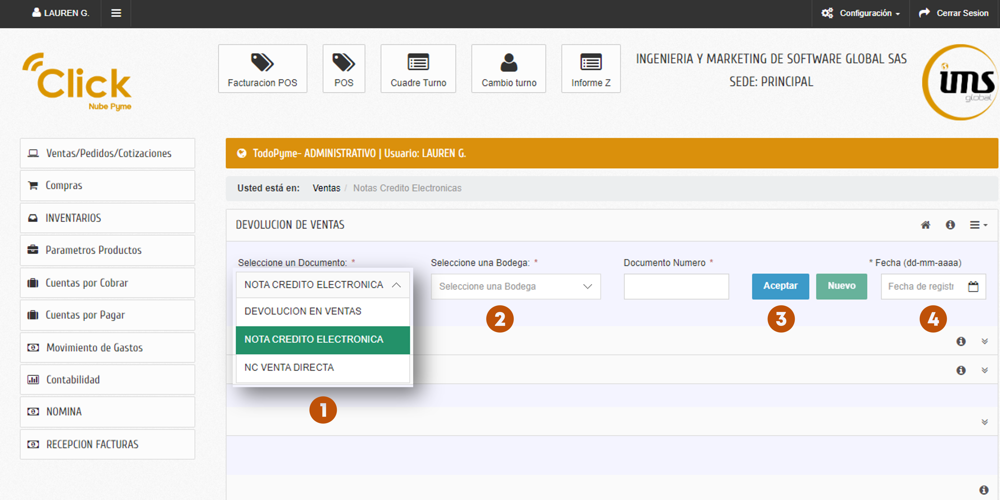 

### 3) Cliente, condición y referencia
- **Cliente** (se trae o selecciona).  
- **Vendedor**, **Lista de precios** y **Condiciones de pago** → **Contado**. 
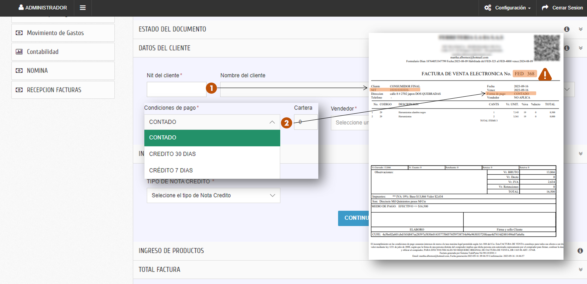

 
- **Tipo de nota crédito** (elige el motivo DIAN).  
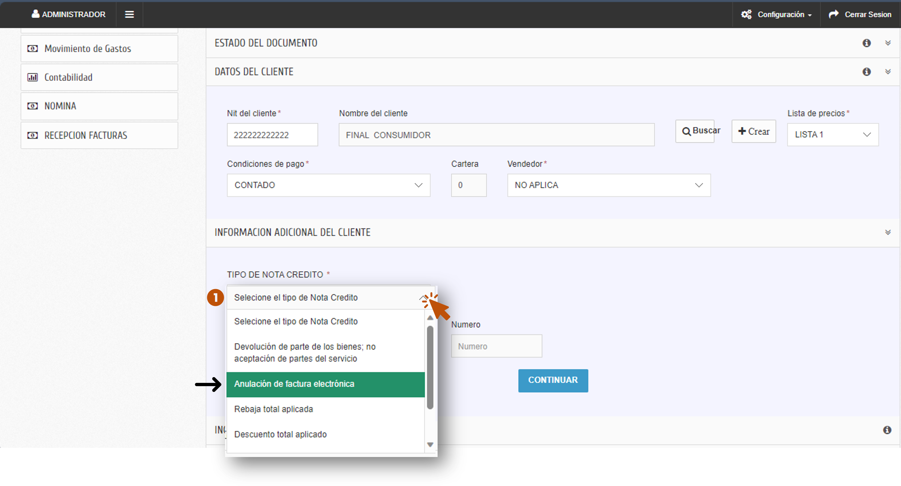

- **Documento a aplicar** → **Buscar** la factura (número/CUFE) → **Continuar**.  
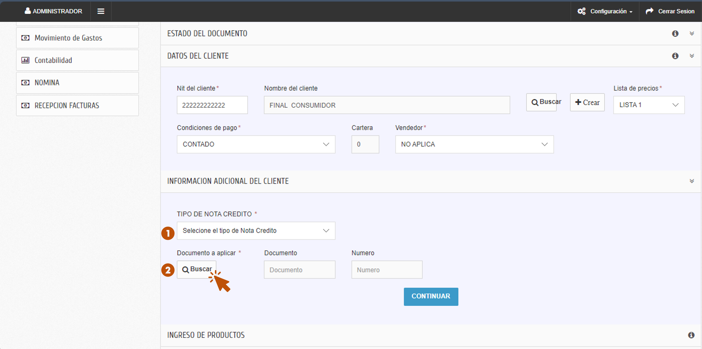

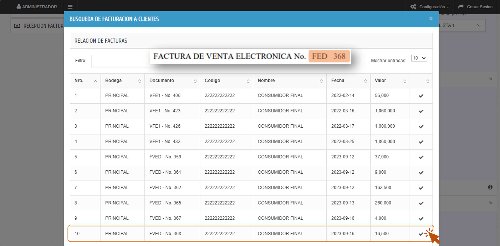

Haz clic en **Continuar** para cargar los productos de la nota credito.
 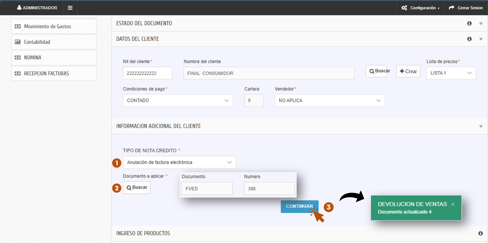

### 4) Paso 1 → Productos
Registra los renglones a reversar: **Código**, **Cantidad**, **Valor unitario**, **Impuesto**.  
> **Cantidad:** `> 0`; **decimales según parametrización**.  
Opcional: **Detalle** y **Descuento**. Usa **Cargar Producto** para añadir; **Borrar ítems** para limpiar.  
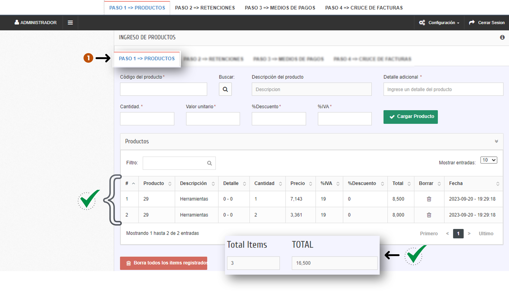

### 5) Paso 2 → Retenciones (si aplica)
Revisa la **tabla de retenciones** y aplica la que corresponda.  
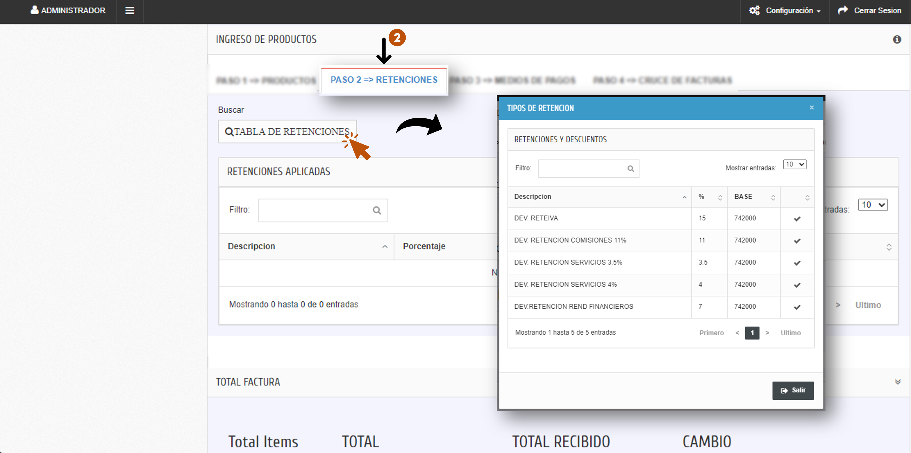

### 6) Paso 3 → Medios de pago (devolución)
Registra el **Tipo de pago** y el **Valor** a devolver (puede ser **pago mixto**, cargando varios).  
Haz **Cargar tipo de pago** para confirmar.  
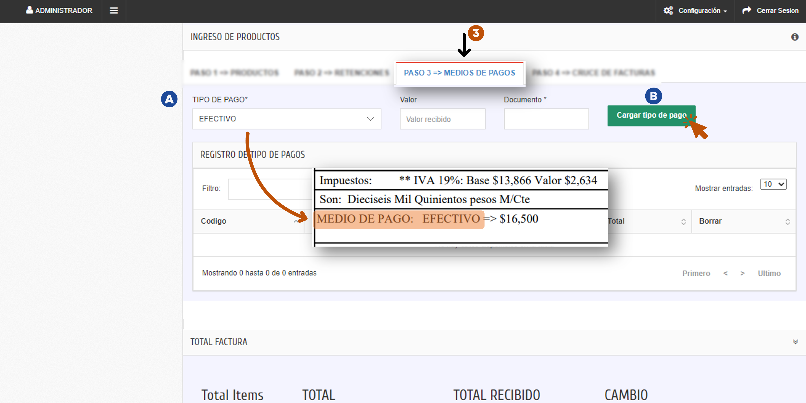

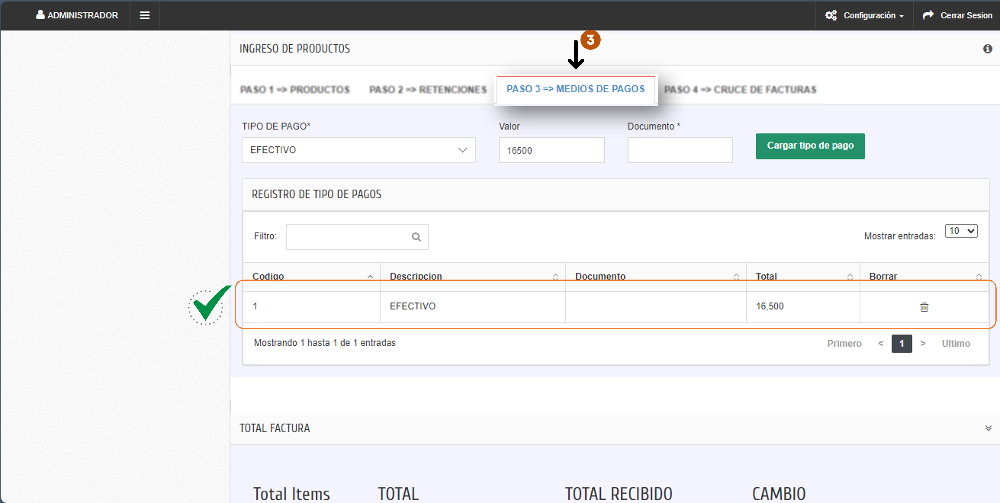

### 7) Paso 4 → Cruce de facturas
- **Documento** (autocompletado con la factura referenciada).  
- **Vr. Recibido** (desde pagos) → **Cargar**.  
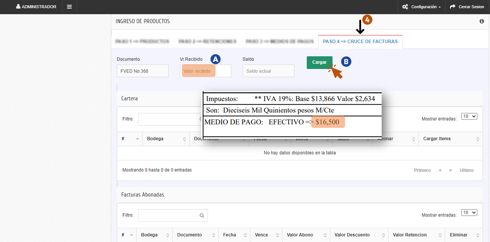

- Verifica **Total abonado** y que **Pendiente x Cruzar = 0** antes de continuar.  
> Si **Pendiente x Cruzar ≠ 0**, faltan pagos o líneas por ajustar.  
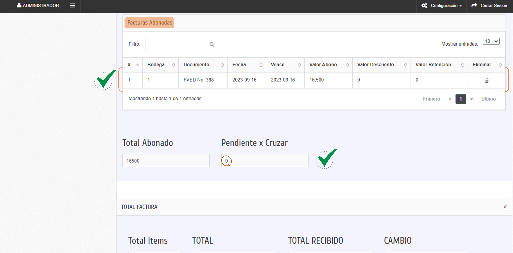

### 8) Cerrar y enviar
- **Grabar** (sin DIAN) / **Borrar** / **Anular**.  
- **Cerrar** → **envía a DIAN** y muestra la respuesta.  
- Verifica estado en **Informe de documentos de venta**.  
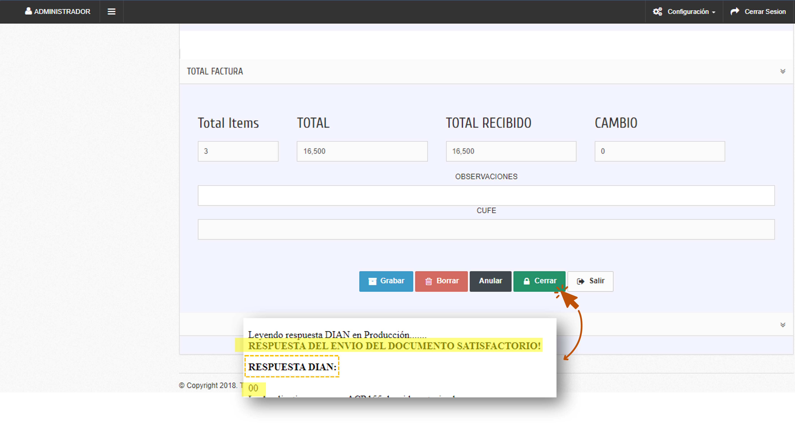

---

## Buenas prácticas
- Describe el **motivo** con precisión (evita “ajuste” genérico).  
- Conserva soporte: ticket/acta/devolución física.  
- Si devuelves dinero, registra el **medio** (efectivo/tarjeta/transferencia) según política de caja.

## FAQs
- **“Pendiente x Cruzar” no llega a 0**  
  Revisa: (a) faltan pagos cargados, (b) valores/ítems no coinciden, (c) retenciones mal aplicadas. Ajusta y vuelve a **Cargar**.

- **No encuentro la factura origen**  
  Confirma número/CUFE y estado **aceptado**. Si la ventana DIAN **venció**, usa el flujo **sin referencia**. 👉 [Ir al hub NCE](./index.md)

- **¿Se mueve inventario?**  
  Solo si tu operación lo exige. Para devoluciones físicas, registra el **ingreso** en inventario según procedimiento.

---

## Campos y validaciones (detalle técnico)

??? info "Ver tabla completa"
    | Campo en pantalla | Oblig./Opc. | Tipo | Validación / Reglas | Notas de negocio |
    |---|---|---|---|---|
    | **Documento** | Obligatorio | Dropdown/Texto | Debe existir en parametrización; sin espacios | Varía por empresa |
    | **Bodega** | Obligatorio | Dropdown/Texto | Debe existir en parametrización | Varía por empresa |
    | **Número** | Obligatorio | Auto/Texto | Autonumera; restricción manual según rol | Consecutivo |
    | **Fecha de factura** | Obligatorio | Fecha | Autocompletado | — |
    | **Aceptar** | — | Acción | Crea nueva NCE (borrador) | — |
    | **Cliente** | Obligatorio | Texto/Búsqueda | Debe existir o crearse; **NIT/DV** válidos | Cliente de la factura |
    | **Vendedor** | Obligatorio | Dropdown | Autocompletado (opciones activas) | Editable |
    | **Lista de precios** | Obligatorio | Dropdown | Autocompletado; **recalcula** precios | Editable |
    | **Condiciones de pago** | Obligatorio | Dropdown/Texto | Catálogo activo | **Contado** |
    | **Tipo de nota crédito** | Obligatorio | Dropdown/Texto | Seleccionar según motivo DIAN | — |
    | **Documento a aplicar** | — | — | — | Factura referenciada |
    | **Buscar** | — | Acción | Ventana de búsqueda (número/CUFE) | Referenciada |
    | **Continuar** | — | Acción | Confirma factura base | — |
    | **Ítem: Código** | Obligatorio | Texto/Búsqueda | Debe existir en productos | — |
    | **Detalle** | Opcional | Texto | Máx. caracteres | — |
    | **Ítem: Cantidad** | Obligatorio | Numérico | `> 0`; **decimales según parametrización** | — |
    | **Ítem: Valor unitario** | Obligatorio | Numérico | `≥ 0`; depende de lista | — |
    | **Ítem: Impuesto** | Obligatorio | Dropdown | Según producto; tasas válidas DIAN | — |
    | **Descuento** | Opcional | Numérico/% | Límite por rol/regla | — |
    | **Cargar Producto** | — | Acción | Valida y agrega línea | — |
    | **Borrar ítems** | — | Acción | Borra todas las líneas | — |
    | **Retenciones (tabla)** | Opcional | Búsqueda | Aplica si corresponde | — |
    | **Tipo de pago** | Obligatorio | Dropdown/Texto | Catálogo activo | Medio de devolución |
    | **Valor (pago)** | Obligatorio | Numérico | **Valor de la devolución** | — |
    | **Cargar tipo de pago** | — | Acción | Confirma pago | — |
    | **Cruce: Documento** | Obligatorio | Texto | Autocompletado | Factura base |
    | **Cruce: Vr. Recibido** | Obligatorio | Numérico | Autocompletado | — |
    | **Cruce: Cargar** | — | Acción | Registra cruce | — |
    | **Total abonado** | Informativo | Numérico | — | Valor de devolución |
    | **Pendiente x Cruzar** | Informativo | Numérico | Debe quedar **0** | Requisito para continuar |
    | **Grabar / Borrar / Anular / Cerrar / Salir** | — | Acción | Flujo estándar | **Cerrar** envía a DIAN |

---

!!! seealso "Guías relacionadas"

    

    -   :material-receipt: **Factura electrónica (NDE)** Básico  
        Emite y envía facturas a DIAN (base para NCE).  
        [:material-arrow-right: Ver guía](../factura-nde.md)

    -   :material-cash-register: **Facturar en POS** Básico  
        Ventas en mostrador, pagos mixtos.  
        [:material-arrow-right: Ver guía](../factura-pos.md)

    -   :material-file-restore: **Hub NCE** Avanzado  
        Elige el flujo: contado/crédito × con/sin referencia.  
        [:material-arrow-right: Ir al hub](./index.md)

    
