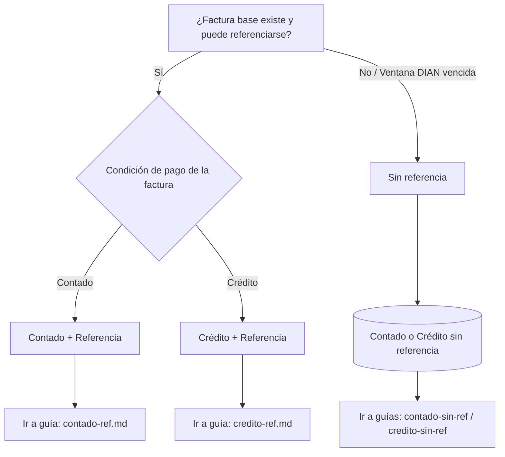

# Nota Crédito Electrónica (NCE) – ¿cuál guía uso?

Una **NCE** revierte total o parcialmente una factura **y** se reporta a la **DIAN**.  
Primero identifica dos cosas:

1. **Condición de pago** de la factura original: **Contado** o **Crédito**.  
2. ¿La NCE **referenciará** una factura específica?  
   - **Sí, con referencia**: se envía a DIAN enlazada a la factura (número/CUFE).  
   - **No, sin referencia**: solo cuando la DIAN **ya no acepta** asociar a esa factura (se afecta el **período**, no un documento puntual).

!!! warning "Cuándo usar *sin referencia*"
    Úsalo **solo** si la ventana de aceptación DIAN ya no permite vincular la NCE con la factura original. En ese caso, la nota impacta ventas/impuestos del **período actual**, sin modificar la factura histórica.

---

## Elige tu ruta

-   :material-cash: **Contado – Con referencia a la factura**  
    Cliente pagó al contado. La NCE *enlaza* a la factura y puede implicar **devolución de dinero**.  
    [:octicons-arrow-right-24: Abrir guía »](contado-ref.md)

-   :material-cash: **Contado – Sin referencia**  
    Para ajustes de período cuando no se puede enlazar. Revisa política de **caja/egresos**.  
    [:octicons-arrow-right-24: Abrir guía »](contado-sin-ref.md)

-   :material-bank: **Crédito – Con referencia a la factura**  
    Disminuye **cartera** del cliente; revisa si hay abonos.  
    [:octicons-arrow-right-24: Abrir guía »](credito-ref.md)

-   :material-bank: **Crédito – Sin referencia**  
    Ajuste por período; afecta ventas/impuestos y **cartera**, sin tocar la factura histórica.  
    [:octicons-arrow-right-24: Abrir guía »](credito-sin-ref.md)

---

## Decisor rápido

